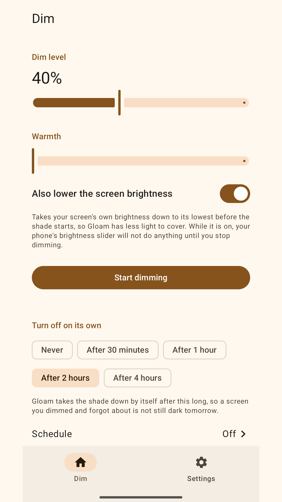
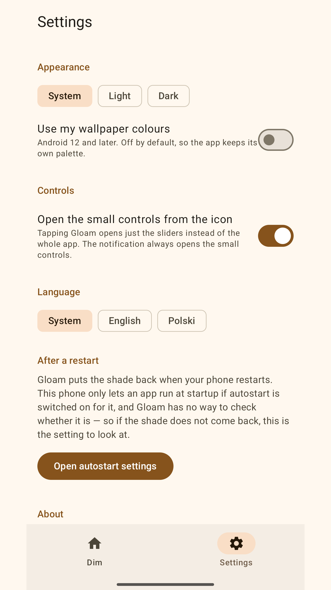
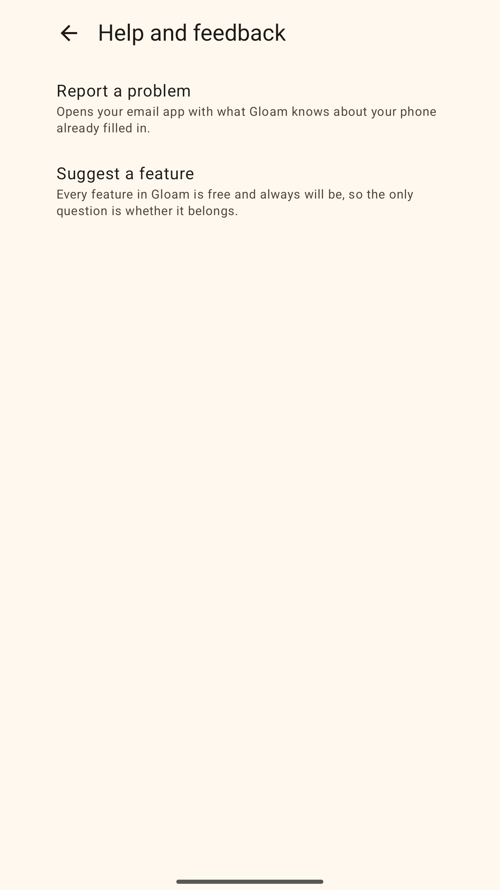
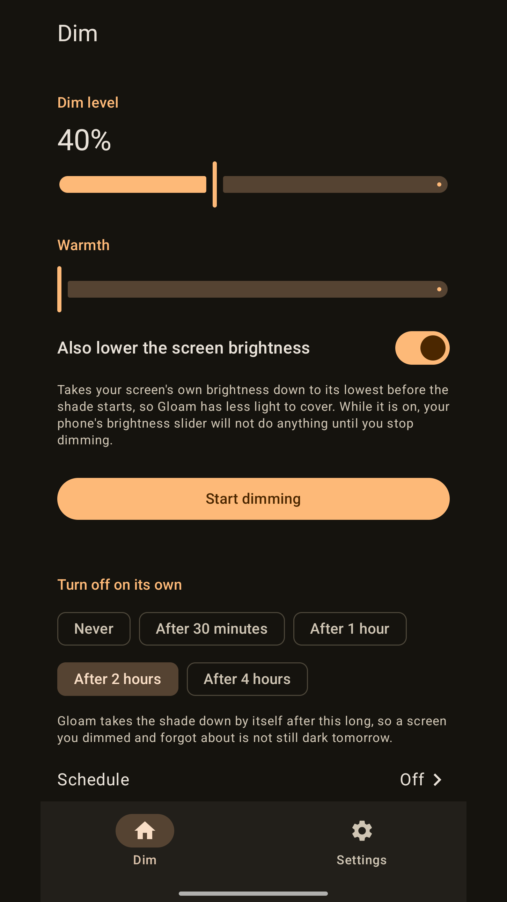
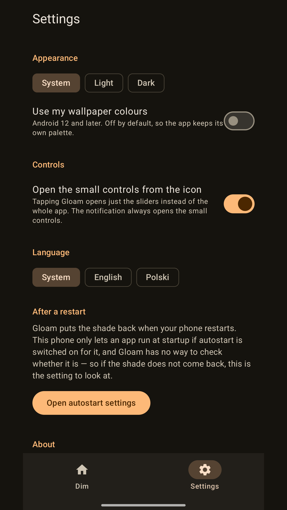
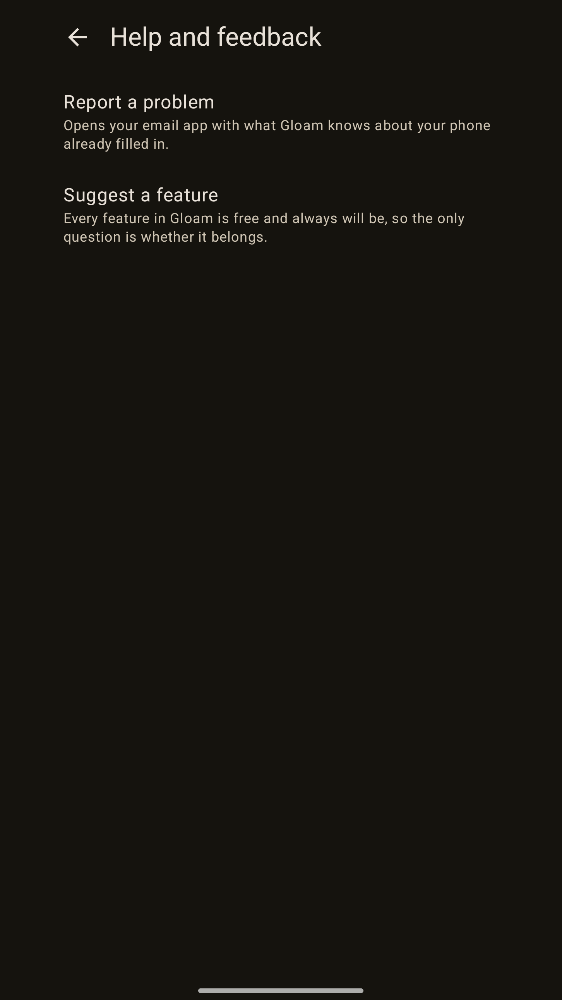

# Gloam

Take the screen below the brightness Android is willing to give you. A dimming overlay for reading
in the dark, when the lowest system setting is still too bright.

**Every feature is free.** No ads, no server, no account, nothing behind a paywall. If the app
earns it there is a one-off tip — it unlocks nothing, it just says thanks.

## Status

Bootstrapped from [android-starter](https://github.com/srednimax/android-starter), and now a working
proof of concept: it dims the screen. A slider sets a dim level, a foreground service draws the shade
over every other app, and it survives you leaving Gloam — which is the whole point, since the apps
being dimmed are the ones you are reading.

A shade you start by hand **comes down on its own** after a while — thirty minutes to four hours, or
never, and two hours unless you say otherwise — and one that was up when the phone went down **comes
back after a restart**. Both exist because a dimmer you forget about is a dimmer that follows you
into the next morning.

**The controls come to where you are.** Tapping the ongoing notification raises a small panel over
whatever you are reading — the one surface in Gloam that stays readable at full dim, because it sits
*above* the shade instead of under it, so the slider moves the dim over the real content rather than
over Gloam's own screen. The launcher icon can be pointed at a compact version of the same controls,
in Settings.

**And it dims on a schedule.** One pair of times — on at one, off at the other, every night,
including a window that runs across midnight. Getting there costs more than it sounds like on a
phone that would rather your app were not running: the shade comes up from an *inexact* alarm, which
Android delivers at the far end of a window 75% as wide as its futurity, so the app arms a chain of
hops toward the on-instant instead of the instant itself
([ADR-0003](docs/adr/0003-two-scheduling-mechanisms.md)'s third amendment has the measurements). And
because one stored deadline now has four writers, there is a rule in front of it: it is *resolved*
when the hand starts a shade and when the schedule's on-instant arrives, and every other writer may
only bring it forward ([ADR-0012](docs/adr/0012-one-deadline-monotone-except-at-a-start.md)).

The template's data layer is gone ([ADR-0007](docs/adr/0007-gloam-stores-settings-not-records-so-it-has-no-database.md)):
Gloam stores settings, not records, so there is no database. The release pipeline and quality gates
are real. Nothing is on Play yet, and the feature set beyond "it dims" is still being decided.

## Screenshots

Light and dark, captured on a Xiaomi/HyperOS device by `scripts/screenshots.py` and padded to Play's
9:16 by `art/pad-screenshot.py`. Regenerate them rather than replacing them by hand — the walk is the
asset, not the pixels.

| Dim | Settings | Help and feedback |
| --- | --- | --- |
|  |  |  |
|  |  |  |

These are Gloam's own screens. **There is deliberately no screenshot of the shade actually down** —
the shade is an overlay owned by a foreground service, so it cannot be reached by tapping through the
app, and a photograph of a dimmed screen is a photograph of a dark rectangle. What the shade does is
the one thing the listing has to describe in words.

## Contributing

Gloam is source-available, not open source: read it, verify it, file issues. Pull requests are not
accepted — see [LICENSE](LICENSE).

## Build

```bash
./gradlew assembleDebug          # build
./gradlew installDebug           # build + install on the connected phone
./gradlew test                   # JVM unit tests
./gradlew connectedAndroidTest   # instrumented tests — needs a device
./gradlew spotlessApply          # format (the CI gate is spotlessCheck)
python3 scripts/project.py       # what the toolchain thinks this app is called
```

Commit subjects are [Conventional Commits](https://www.conventionalcommits.org); release-please
derives the version and `CHANGELOG.md` from them. See [docs/RELEASING.md](docs/RELEASING.md).
